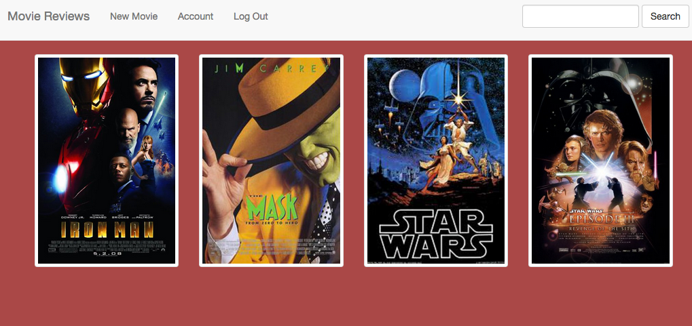
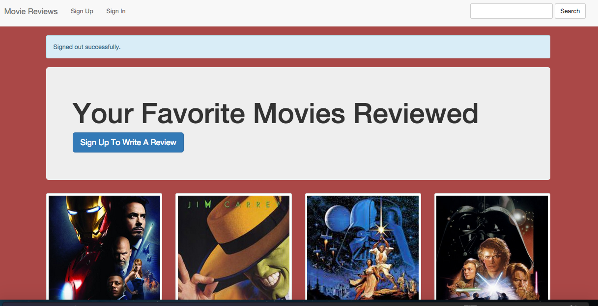
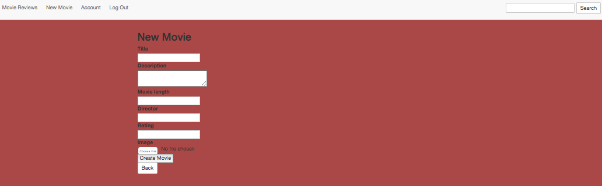
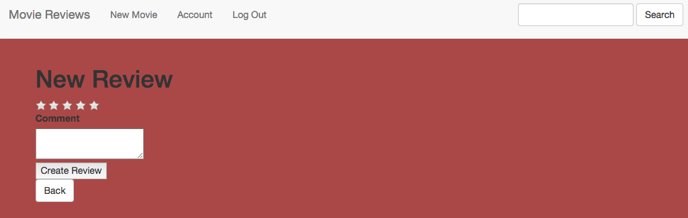
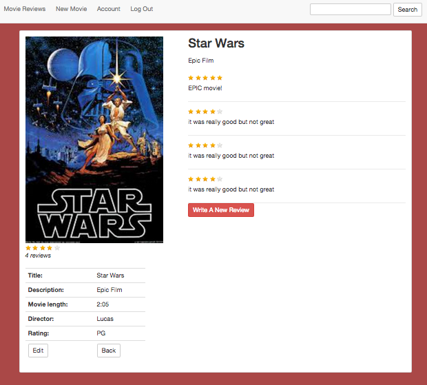

#README

####This is a Movie Review app that I built to practice implementing devise and some other handy gems.  A full list can be seen in the gem file.  The styling is minimalistic to concentrate on the functionality.

**A User can view all the submitted votes and movies.**

**A User Can Sign in/up via Devise.**

**A user Can Submit a new movie and review.**

**A user can view and indivual movies/reviews as well.**

